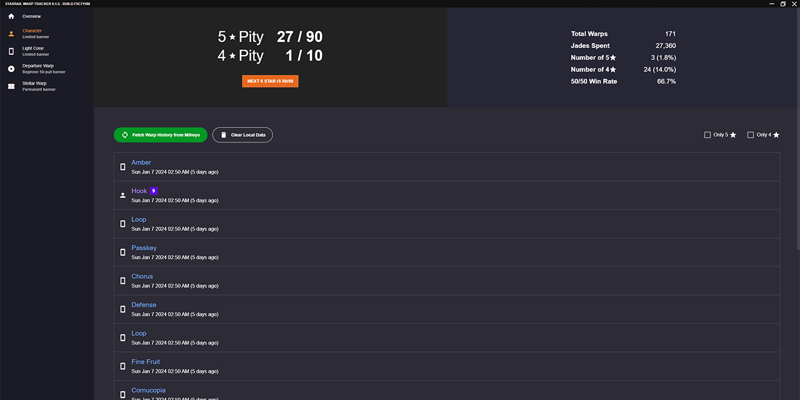

# StarRail Warp Tracker

This is a Windows application to track and backup your Honkai StarRail warp history.



## FAQ

### Why not use one of the other existing warp trackers?

Any warp tracker application (including this one) requires you to give them your authentication key in order to access Mihoyo's (undocumented) API.
Since nobody knows what permissions that key has, I do not feel comfortable using those applications.
Although nobody in the community has reported any issues yet, there's no guarantee those applications won't be compromised in the future.

Since this application works entirely client side, you can verify it is not malicious by checking the source code or inspecting your network traffic.

### Why is there a Windows Defender warning?

Windows will flag any executables that are not signed with a paid certificate (about $500 USD/year).
Since I'm not going to pay for a certificate for a hobby project, there's nothing I can do about this warning.

### Where is the application data stored?

```
C:\Users\[Your Name]\AppData\Roaming\StarRail Warp Tracker\starrail-warp-tracker.sqlite3
```

Do **not** modify this file while the application is open or else you risk corrupting your data.

### Why are there no images of characters or light cones?

This application is large enough as it is (because it is built with Electron).
In addition, I do not want to have to keep updating this application every month to keep up with the game's new banners.

### Why Electron?

Because it is the easiest GUI framework that I am familiar with that can maintain consistency across all machines and operating systems.
