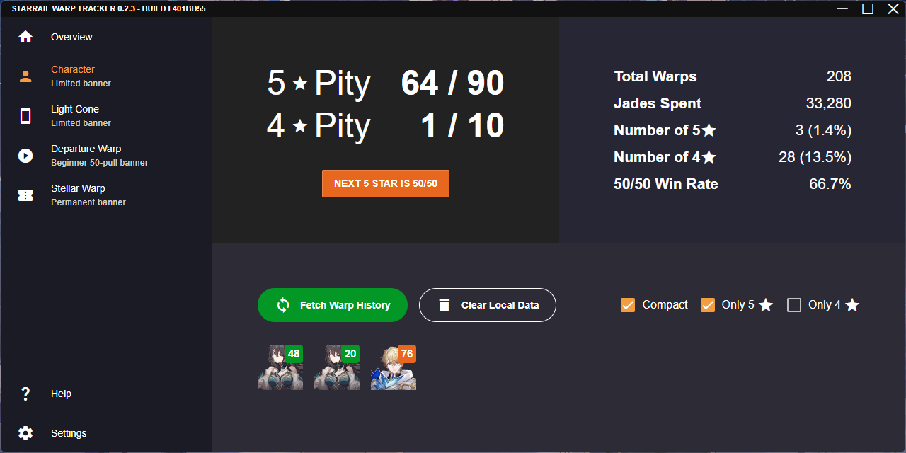

# StarRail Warp Tracker

This is a Windows application to track and backup your Honkai StarRail warp history.



## FAQ

### Why not use one of the other existing warp trackers?

Other warp trackers are website based and thus require you to manually execute their Powershell script to extract your account's authentication key in order to access Mihoyo's (undocumented) API.
This process is very cumbersome every time you wish to update your warp history.

In addition, although nobody in the community has reported any issues yet, there is still some risk when giving away your authentication keys to third parties.
Since this application works entirely client side, you can verify it is not malicious by checking the source code or inspecting your network traffic.

### Why is there a Windows Defender warning?

Windows will flag any executables that are not signed with a paid certificate (about $500 USD/year).
Since I'm not going to pay for a certificate for a hobby project, there's nothing I can do about this warning.

### Where is the application data stored?

```
C:\Users\[Your Name]\AppData\Roaming\StarRail Warp Tracker\starrail-warp-tracker.sqlite3
```

Do **not** modify this file while the application is open or else you risk corrupting your data.

### Why Electron?

Because it is the easiest GUI framework that I am familiar with that can maintain consistency across all machines and operating systems.
